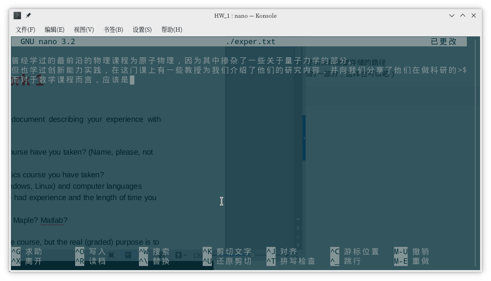

---
html:
    embed_local_images: true
    offline: true
    toc: true
---
# 计算物理第一次作业
>万国麟
2017141221045


<!-- @import "[TOC]" {cmd="toc" depthFrom=1 depthTo=6 orderedList=false} -->

<!-- code_chunk_output -->

* [计算物理第一次作业](#计算物理第一次作业)
	* [Problem 1](#problem-1)
	* [Problem 2](#problem-2)
		* [使用shell脚本](#使用shell脚本)
		* [使用Python](#使用python)
		* [结果](#结果)

<!-- /code_chunk_output -->

## Problem 1
使用`cd`将终端的工作路径切换到想要存储的路径。
运行（既然nano是emacs的一部分，这样也可以吧）。
```bash
nano ./exper.txt
```
对文件内容进行更改

编写之后的文档为工作目录中的`exper.txt`。
文件内容为
```
曾经学过的最前沿的物理课程为原子物理，因为其中掺杂了一些关于量子力学的部分。
但也学过创新能力实践，在这门课上有一些教授为我们介绍了他们的研究内容，并向我们分享了他们在做科研的过程中发生过的一些趣事。
而对于数学课程而言，应该是数学物理方法这门课程了吧。
虽说这一门课程更偏向物理，但其实我认为也是物理研究过程中所需要的数学知识的汇总吧。
从05年接触电脑开始至去年一直使用Windows，期间也曾接触过Mac OS X，以及deepin、CentOS，Ubuntu、Fedora、debian、Arch等Linux系统。
自去年开始接触Manjaro这一Linux开始，便开始使用单一Linux作为日常使用的操作系统。
曾经接触过Quick Basic，学习过C语言，但都没有真正是用来编写过什么东西。
去年开始学习Python，曾为一个命令行软件制作过简单的GUI。
上一学期的光学曾使用过MATLAB来进行光学问题的模拟。

```
## Problem 2
### 使用shell脚本
因为发现使用过程中需要对元素索引进行操作，所以采用脚本而不是单独的指令来完成。
脚本具体内容如下:
```bash
#!/usr/bin/env bash

filePath="./lcrs.txt"

maxIndex=0
minIndex=0
flag=1
#得到最大值索引
function getMaxIndex () {
    local arr=($1)
    local length=${#arr[@]}
    local max=-100000
    for((i=0;i<$length;i++)); do
        local var=$(echo "${arr[$i]}>$max" | bc)
        if [ "$var" -eq 1 ]; then
            max=${arr[$i]}
            maxIndex=$i
        fi
    done
}
#得到最小值索引
function getMinIndex () {
    local arr=($1)
    local length=${#arr[@]}
    local min=100000
    for((i=0;i<$length;i++)); do
        local var=$(echo "${arr[$i]}<$min" | bc)
        if [ "$var" -eq 1 ]; then
            min=${arr[$i]}
            minIndex=$i
        fi
    done
}

rawStr=$(cat $filePath | xargs) #读入文件并去除换行符
str=${rawStr##*#}   #刨除“#”符号的影响
arr=($str)
unset cz theta phi AM
length=${#arr[@]}
for((i=0;i<$length;i+=4)); do
    cz+=("${arr[i]}")
    theta+=("${arr[i+1]}")
    phi+=("${arr[i+2]}")
    AM+=("${arr[i+3]}")
done
#新建用于存储的索引的列表
unset czIndex AMIndex
#结果字符串
unset result
result+="Ploblem 2 \n"
#A部分的解答
result+="Part A \n"
getMaxIndex "${cz[*]}"
getMinIndex "${cz[*]}"
czIndex=($maxIndex $minIndex)
result+="The lagest recession velocity is: ${cz[$maxIndex]}. \n"
result+="The smallest recession velocity is: ${cz[$minIndex]}. \n"
#B部分的解答
result+="Part B \n"
getMaxIndex "${AM[*]}"
getMinIndex "${AM[*]}"
result+="The recession velocities of the brightest galaxies is: ${cz[$minIndex]}. \n"
result+="The recession velocities of the faintest galaxies is: ${cz[$maxIndex]}. \n"
#C部分的解答
echo -e $result
result+="Part C \n"
echo -e "Please input the answer for Part C:"
read partC
result+=$partC
#输出到文件
echo -e $result > galaxies.txt
```
将该脚本保存为`HW_1.sh`并运行，即可将第二问的答案写入工作目录的`galaxies.txt`文件中。
### 使用Python
使用Python来完成该工作则要简单一些
```python
from os.path import abspath,dirname
from numpy import array,reshape

filePath=dirname(abspath(__file__))

#用于数据处理的部分
with open(filePath+"/lcrs.txt","r") as f:
    rawStr=f.read()
numList=rawStr.split("#")[-1].replace("\n"," ").split()
numArray=array(numList).reshape([-1,4])
czList,thetaList,phiList,AMList=[numArray[:,k].tolist() for k in range(4)]
czList=list(map(int,czList))
czResultList=[max(czList),min(czList)]
AMList=list(map(float,AMList))
AMResultList=[czList[AMList.index(min(AMList))],czList[AMList.index(max(AMList))]]
#输出文件的格式
result="Problem 2 \n"
result+="Part A \n"
result+="The lagest recession velocity is: "
result+=str(czResultList[0])
result+="\nThe smallest recession velocity is: "
result+=str(czResultList[1])
result+="\nPart B \n"
result+="The recession velocities of the brightest galaxies is: "
result+=str(AMResultList[0])
result+="\nThe recession velocities of the faintest galaxies is: "
result+=str(AMResultList[1])
print(result+"\n")
result+="\nPart C \n"
partC=input("Please input the answer for Part C: \n")
result+=partC
#输出文件
with open(filePath+"/galaxies.txt","w") as f:
    f.writelines(result)
```
将该脚本保存为`HW_1.py`并运行，即可将第二问的答案写入工作目录的`galaxies.txt`文件中。
### 结果
文件的内容为
```
Problem 2 
Part A 
The lagest recession velocity is: 78736
The smallest recession velocity is: 3734
Part B 
The recession velocities of the brightest galaxies is: 54610
The recession velocities of the faintest galaxies is: 3734
Part C 
在（B）中得到的结果通过除以哈勃常数得到的结果过小，不符合天文观测的基本长度单位。
```