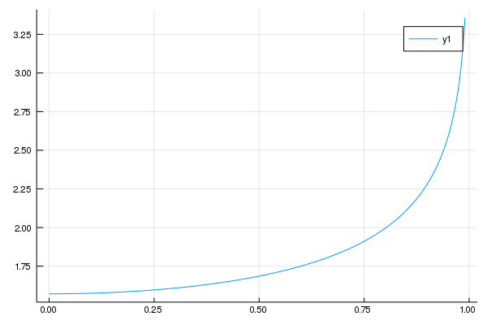
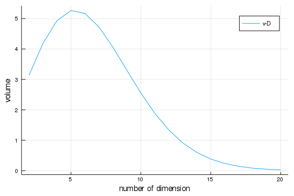

---
html:
    embed_local_images: true
    offline: true
    toc: true
---  
  
#  计算物理第十次作业
  
> 万国麟
> 2017141221045
  
  
  
  
  
  
- [ 计算物理第十次作业](#计算物理第十次作业 )
  - [ Problem 1](#problem-1 )
    - [ Code](#code )
    - [ 运行结果及分析](#运行结果及分析 )
  - [ Problem 2](#problem-2 )
    - [ Code](#code-1 )
    - [ 运行结果及分析](#运行结果及分析-1 )
  - [ Problem 3](#problem-3 )
    - [ Code](#code-2 )
    - [ 运行结果及分析](#运行结果及分析-2 )
  
  
  
  
  
##  Problem 1
  
###  Code
  
```julia
using Plots;gr()
#引入自适应辛普森积分
include("../HW_9/Adaptive.jl")
#定义使用自适应辛普森积分用于变自变量积分的函数
function Integrate(func,trans,dTrans,antiTrans,lower,upper)
    tolerance=10e-10    #定义误差下限
    lT=antiTrans(lower) #变换后积分下限
    uT=antiTrans(upper) #变换后积分上限
    funcT(x)=func(trans(x))*dTrans(x)   #变换后被积函数
  
    result=Adaptive(funcT,lT,uT,false,tolerance)[1] #积分过程
    return result
end
  
#Part a1
print("Part A\n")
func(x)=sqrt(1-x^2)
trans(x)=cos(x)
dTrans(x)=-sin(x)
antiTrans(x)=acos(x)
result=Integrate(func,trans,dTrans,antiTrans,-1,1)
print("The result of the raw integrate is ",result,"\n")
#Part a2
funcT(x)=sin(x)^2
result=Adaptive(funcT,0,pi,false,10^(-10))[1]
print("The result of integrate is ",result,"\n")
  
#Part b
function partB()
    print("Part B\n")
    ks=Array(LinRange(0,0.99,1000))
    results=zeros(1000)
    for i=1:length(ks)
        k=ks[i]
        θ=2asin(k)
        funcT(x)=1/sqrt(1-k^2*sin(x)^2)
        result=Adaptive(funcT,0,pi/2,false,10^(-10))[1]
        results[i]=result
    end
    plot(ks,results)
    png(joinpath(@__DIR__,"Problem_1_B.png"))
    print("The result has been saved in an image.\n")
end
partB()
  
#Part c(不使用预先推导进行计算)
function partC_raw()
    print("Part C (raw)\n")
    func(x)=1/((1+x)*sqrt(x))
    trans(x)=x^2
    dTrans(x)=2x
    antiTrans(x)=sqrt(x)
    temp=now=0
    count=1
    while true
        temp=Integrate(func,trans,dTrans,antiTrans,10^(-10),10^count)
        if abs(temp-now)<now/100
            break
        end
        now=temp
        count+=1
    end
    print("The result of the raw integrate is ",temp,"\n")
end
partC_raw()
#Part c(使用预先推导进行计算)
function partC_after()
    print("Part C (fixed)\n")
    temp=now=0
    count=1
    funcT(x)=2/(1+x^2)
    while true
        temp=Adaptive(funcT,0,10^count,false,10^(-10))[1]
        if abs(temp-now)<now/100
            break
        end
        now=temp
        count+=1
    end
    print("The result of the fixed integrate is ",temp,"\n")
end
partC_after()
```  
###  运行结果及分析
  
>Part A
>The result of the raw integrate is 1.5707963267948968
>The result of integrate is 1.5707963267948966
>Part B
>The result has been saved in an image.
>Part C (raw)
>The result of the raw integrate is 3.135248119345212
>Part C (fixed)
>The result of the fixed integrate is 3.1395926542564587
  
其中Part B的结果如下图

>Figure 1 Part B
  
其中`Integrate`函数为使用自适应辛普森积分来进行自变量变换的积分过程.其中,`trans`函数为变自变量的变换函数,`dTrans`函数为变换函数的导数,`antiTrans`为变换函数的反函数.
##  Problem 2
  
###  Code
  
```julia
include("../HW_9/Adaptive.jl")  #引入自适应辛普森积分
  
f(x)=exp(-x^2)  #定义被积函数
  
function Gaussian()
    temp=now=0
    count=1
    while true
        temp=Adaptive(f,0,10^count,false,10^(-10))[1]
        if abs(temp-now)<now/10^2
            break
        end
        now=temp
        count+=1
    end
    result=2temp
    print("The approximate result of the integration is ",result,"\n")
    print("The related error of this result is ",abs(result-sqrt(pi))/sqrt(pi))
end
Gaussian()
```  
###  运行结果及分析
  
>The approximate result of the integration is 1.7724538509055157
>The related error of this result is 1.2527525318167949e-16
  
其中`Gaussian`函数为用于积分的主函数,其停止条件为后续积分值对总积分值的影响小于1%,这样既避免了积分到无穷或非常大的值时引起的发散,又可以很好地保证积分值的准确性.
##  Problem 3
  
###  Code
  
```julia
using Plots;gr()
  
include("../HW_9/Adaptive.jl")
  
function calculate(D)
    result=2
    for i=2:D
        func(x)=cos(x)^i
        result*=Adaptive(func,-pi/2,pi/2,false,10^(-10))[1]
    end
    return result
end
function Plot()
    Ds=Array([i for i=2:20])
    vs=similar(Ds,Float64)
    vs.=calculate.(Ds)
    plot(Ds,vs,xlabel="number of dimension",ylabel="volume",label="v-D")
    png(joinpath(@__DIR__,"Problem_3.png"))
end
Plot()
```  
###  运行结果及分析
  
该过程使用自适应辛普森积分进行多维球体体积的计算,其中被积函数的推导如下:[^1]
体积的递推公式为
<p align="center"></p>  
  
设,有
<p align="center"></p>  
  
迭代次得
<p align="center"></p>  
  
其中,从而
<p align="center"></p>  
  
最终结果如下图

>Figure 2 多维球体体积与维度的关系
  
  
[^1]:https://spaces.ac.cn/archives/3154
  