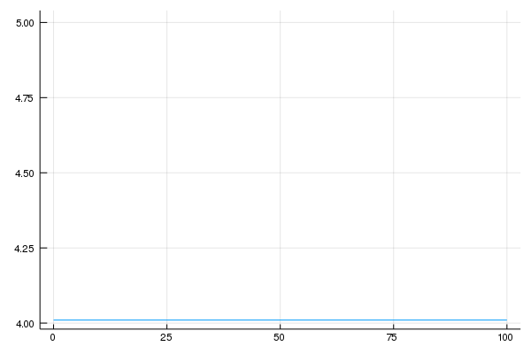
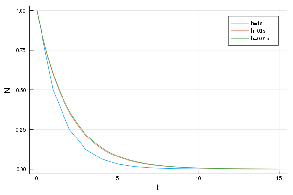

#  计算物理第十一次作业
  
>万国麟
>2017141221045
  
  
  
  
  
  
- [ 计算物理第十一次作业](#计算物理第十一次作业 )
  - [ Problem 1](#problem-1 )
    - [ Code](#code )
    - [ 运行结果与分析](#运行结果与分析 )
  - [ Problem 2](#problem-2 )
    - [ Code](#code-1 )
    - [ 运行结果与分析](#运行结果与分析-1 )
  - [ Problem 3](#problem-3 )
    - [ Code](#code-2 )
    - [ 运行结果及分析](#运行结果及分析 )
  
  
  
  
  
##  Problem 1
  
###  Code
  
euler法和euler improved方法定义在`Ruler.jl`文件中
```julia
function euler(dfunc,start,funcStart,step,stop)
    xs=range(start,stop=stop,step=step)
    ys=similar(xs)
    ys[1]=funcStart
    for i=2:length(xs)
        ys[i]=ys[i-1]+step*dfunc(xs[i-1],ys[i-1])
    end
    return xs,ys
end
function eulerImproved(dfunc,start,funcStart,step,stop)
    xs=range(start,stop=stop,step=step)
    ys=similar(xs)
    ys[1]=funcStart
    for i=2:length(xs)
        ySub=ys[i-1]+step*dfunc(xs[i-1],ys[i-1])
        yHat=ys[i-1]+step*dfunc(xs[i],ySub)
        ys[i]=(yHat+ySub)/2
    end
    return xs,ys
end
```  
Problem 1的主程序在`Problem_1.jl`文件中
```julia
using Plots;gr()
using CurveFit
  
include("Euler.jl")
  
function err(i)
    dfunc(x,y)=1-x+4y
    func(x)=(4exp(-4x)-3exp(-4x)+19)/(16exp(-4x))
    xs,ys=euler(dfunc,0,1,10.0^(-i),1)
    plot(xs,ys,label="euler method")
    laws=func.(xs)
    plot!(xs,laws,label="accurate values")
    err1=abs.(laws-ys)./laws
    xs,ys=eulerImproved(dfunc,0,1,10.0^(-i),1)
    plot!(xs,ys,label="improved euler method")
    err2=abs.(laws-ys)./laws
    png(joinpath(@__DIR__,"results/Problem_1_$i.png"))
    return sum(err1)/length(err1),sum(err2)/length(err2)
end
function main()
    errE=zeros(5)
    errEI=zeros(5)
    for i=1:5
        errE[i],errEI[i]=err(i)
    end
    steps=[10.0^(-i) for i=1:5]
    plot(steps,errE,label="euler method",xscale=:log10,yscale=:log10,xlabel="step",yticks=[10.0^(i/10) for i=-20:0],ylabel="relative error")
    plot!(steps,errEI,label="improved euler method")
    print("The power of Euler Method is ",power_fit(steps,errE)[2],"\n")
    print("The power of Improved Euler Method is ",power_fit(steps,errEI)[2],"\n")
    png(joinpath(@__DIR__,"Problem_1.png"))
end
main()
```  
###  运行结果与分析
  
>The power of Euler Method is 0.20789215712911258
>The power of Improved Euler Method is 0.06823235351439315
  
输出图像如下

>Figure 1 两种方法相对误差比较
  
可以很明显看出,euler improved方法所得相对误差要远远小于euler方法.但是对于相对误差和步长的拟合,我认为tony之前的图像是错误的,他所得的结果应该为绝对误差与步长的拟合,而相对误差与步长的拟合,应该如上所示,幂次非常小.
##  Problem 2
  
###  Code
  
```julia
using Plots;gr()
  
f(x)=exp(-x)
df(x)=-exp(-x)
  
function diffF(func,node,h)
    diff=(func(node+h)-func(node))/h
    return diff
end
function diffC(func,node,h)
    diff=(func(node+h/2)-func(node-h/2))/h
    return diff
end
function divide(node)
    step=10^(-2)
    while true
        F=diffF(f,node,step)
        C=diffC(f,node,step)
        errF=abs(F-df(node))
        errC=abs(C-df(node))
        if errC>errF
            break
        end
        step+=1
    end
    print("The target point is ",node,"the dividing point is ",step,"\n")
    return step
end
function main()
    nodes=[i for i=0:10:100]
    steps=similar(nodes,Float64)
    for i=1:length(nodes)
        steps[i]=divide(nodes[i])
    end
    plot(nodes,steps,legend=false)
    png(joinpath(@__DIR__,"Problem_2.png"))
end
main()
```  
###  运行结果与分析
  
>The target point is 0, the dividing point is 4.01
>The target point is 10, the dividing point is 4.01
>The target point is 20, the dividing point is 4.01
>The target point is 30, the dividing point is 4.01
>The target point is 40, the dividing point is 4.01
>The target point is 50, the dividing point is 4.01
>The target point is 60, the dividing point is 4.01
>The target point is 70, the dividing point is 4.01
>The target point is 80, the dividing point is 4.01
>The target point is 90, the dividing point is 4.01
>The target point is 100, the dividing point is 4.01
  
输出图像如下

>Figure 2 求导点与微分变换分界点
  
使用Forward方式来进行求导时,误差余项为,而使用Central方法来进行求导时,误差余项为.令两误差余项相等,得解:
<p align="center"></p>  
  
理论推导值与实际检验值相符,所以函数两种求导方式误差变换点即为两种求导误差相等的点.
##  Problem 3
  
###  Code
  
```julia
using Plots;gr()
using LaTeXStrings
  
function forward(now,h,τ)
    return (1-h/τ)*now
end
function partA()
    ts=range(0,15,step=1)
    n=length(ts)
    Ns=zeros(n)
    Ns[1]=1
    for i=2:n
        Ns[i]=forward(Ns[i-1],1,2)
    end
    plot(ts,Ns,label="h=1s",xlabel="t",ylabel="N")
  
    ts=range(0,15,step=0.1)
    n=length(ts)
    Ns=zeros(n)
    Ns[1]=1
    for i=2:n
        Ns[i]=forward(Ns[i-1],0.1,2)
    end
    plot!(ts,Ns,label="h=0.1s",xlabel="t",ylabel="N")
  
    ts=range(0,15,step=0.01)
    n=length(ts)
    Ns=zeros(n)
    Ns[1]=1
    for i=2:n
        Ns[i]=forward(Ns[i-1],0.01,2)
    end
    plot!(ts,Ns,label="h=0.01s",xlabel="t",ylabel="N")
  
    png(joinpath(@__DIR__,"Problem_3_partA.png"))
end
function partB()
    ts=range(0,15,step=0.01)
    n=length(ts)
    Ns=zeros(n)
    Ns[1]=1
    for i=2:n
        Ns[i]=forward(Ns[i-1],0.01,5)
    end
    plot(ts,Ns,label=L"\tau=5s",xlabel="t",ylabel="N")
  
    ts=range(0,15,step=0.01)
    n=length(ts)
    Ns=zeros(n)
    Ns[1]=1
    for i=2:n
        Ns[i]=forward(Ns[i-1],0.01,3)
    end
    plot!(ts,Ns,label=L"\tau=3s",xlabel="t",ylabel="N")
  
    ts=range(0,15,step=0.01)
    n=length(ts)
    Ns=zeros(n)
    Ns[1]=1
    for i=2:n
        Ns[i]=forward(Ns[i-1],0.01,1)
    end
    plot!(ts,Ns,label=L"\tau=1s",xlabel="t",ylabel="N")
  
    ts=range(0,15,step=0.01)
    n=length(ts)
    Ns=zeros(n)
    Ns[1]=1
    for i=2:n
        Ns[i]=forward(Ns[i-1],0.01,0.1)
    end
    plot!(ts,Ns,label=L"\tau=0.1s",xlabel="t",ylabel="N")
  
    ts=range(0,15,step=0.01)
    n=length(ts)
    Ns=zeros(n)
    Ns[1]=1
    for i=2:n
        Ns[i]=forward(Ns[i-1],0.01,0.01)
    end
    plot!(ts,Ns,label=L"\tau=0.01s",xlabel="t",ylabel="N")
  
    png(joinpath(@__DIR__,"Problem_3_partB.png"))
end
function forwardD(now,nowP,h,τ,τP)
    return (1-h/τ)*now+h/τP*nowP
end
function partC()
    ts=range(0,15,step=0.01)
    n=length(ts)
    NP=zeros(n)
    ND=similar(NP)
    NP[1]=1
    ND[1]=0
    for i=2:n
        NP[i]=forward(NP[i-1],0.01,2)
        ND[i]=forwardD(ND[i-1],NP[i-1],0.01,0.02,2)
    end
    plot(ts,ND,label=L"\tau_{D}=0.02s",xlabel="t",ylabel="N")
  
    ts=range(0,15,step=0.01)
    n=length(ts)
    NP=zeros(n)
    ND=similar(NP)
    NP[1]=1
    ND[1]=0
    for i=2:n
        NP[i]=forward(NP[i-1],0.01,2)
        ND[i]=forwardD(ND[i-1],NP[i-1],0.01,2,2)
    end
    plot!(ts,ND,label=L"\tau_{D}=2s",xlabel="t",ylabel="N")
  
    ts=range(0,15,step=0.01)
    n=length(ts)
    NP=zeros(n)
    ND=similar(NP)
    NP[1]=1
    ND[1]=0
    for i=2:n
        NP[i]=forward(NP[i-1],0.01,2)
        ND[i]=forwardD(ND[i-1],NP[i-1],0.01,200,2)
    end
    plot!(ts,ND,label=L"\tau_{D}=200s",xlabel=L"t(\tau_{P}=2s)",ylabel="N",yticks=LinRange(0,1,5))
  
    png(joinpath(@__DIR__,"Problem_3_partC.png"))
end
  
partA()
partB()
partC()
```  
###  运行结果及分析
  

>Figure 3 的变化对于推到结果的影响
  

>Figure 4 的变化对于推到结果的影响
  

>Figure 5 对于子离子丰度的影响
  