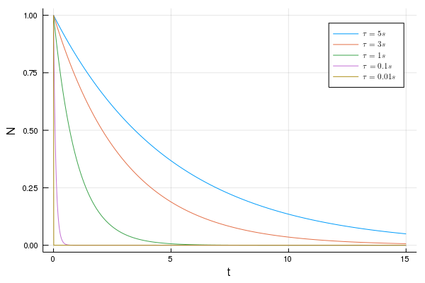

---
html:
    embed_local_images: true
    offline: true
    toc: true
---
# 计算物理第十一次作业
>万国麟
>2017141221045

<!-- @import "[TOC]" {cmd="toc" depthFrom=1 depthTo=6 orderedList=false} -->

<!-- code_chunk_output -->

- [ 计算物理第十一次作业](#计算物理第十一次作业)
  - [ Problem 1](#problem-1)
    - [ Code](#code)
    - [ 运行结果与分析](#运行结果与分析)
  - [ Problem 2](#problem-2)
    - [ Code](#code-1)
    - [ 运行结果与分析](#运行结果与分析-1)
  - [ Problem 3](#problem-3)
    - [ Code](#code-2)
    - [ 运行结果及分析](#运行结果及分析)

<!-- /code_chunk_output -->

## Problem 1
### Code
euler法和euler improved方法定义在`Ruler.jl`文件中
@import "./Euler.jl" {as=julia}
Problem 1的主程序在`Problem_1.jl`文件中
@import "./Problem_1.jl" {as=julia}
### 运行结果与分析
>The power of Euler Method is 0.20789215712911258
>The power of Improved Euler Method is 0.06823235351439315

输出图像如下

>Figure 1 两种方法相对误差比较

可以很明显看出,euler improved方法所得相对误差要远远小于euler方法.但是对于相对误差和步长的拟合,我认为tony之前的图像是错误的,他所得的结果应该为绝对误差与步长的拟合,而相对误差与步长的拟合,应该如上所示,幂次非常小.
## Problem 2
### Code
@import "./Problem_2.jl" {as=julia}
### 运行结果与分析
>The target point is 0, the dividing point is 4.01
>The target point is 10, the dividing point is 4.01
>The target point is 20, the dividing point is 4.01
>The target point is 30, the dividing point is 4.01
>The target point is 40, the dividing point is 4.01
>The target point is 50, the dividing point is 4.01
>The target point is 60, the dividing point is 4.01
>The target point is 70, the dividing point is 4.01
>The target point is 80, the dividing point is 4.01
>The target point is 90, the dividing point is 4.01
>The target point is 100, the dividing point is 4.01

输出图像如下

>Figure 2 求导点与微分变换分界点

使用Forward方式来进行求导时,误差余项为$\frac{h}{2}\left|f^{\prime \prime}(x)\right|+\frac{h^{2}}{6}\left|f^{\prime \prime \prime}(x)\right|$,而使用Central方法来进行求导时,误差余项为$\frac{h^{2}}{24}\left|f^{\prime \prime \prime}(x)\right|$.令两误差余项相等,得解:
$$
h=4
$$
理论推导值与实际检验值相符,所以函数两种求导方式误差变换点即为两种求导误差相等的点.
## Problem 3
### Code
@import "./Problem_3.jl" {as=julia}
### 运行结果及分析

>Figure 3 $h$的变化对于推到结果的影响

>Figure 4 $\tau$的变化对于推到结果的影响

>Figure 5 $\tau_{P}$对于子离子丰度的影响