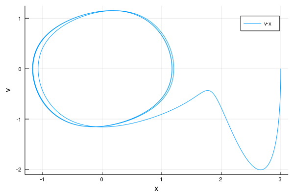
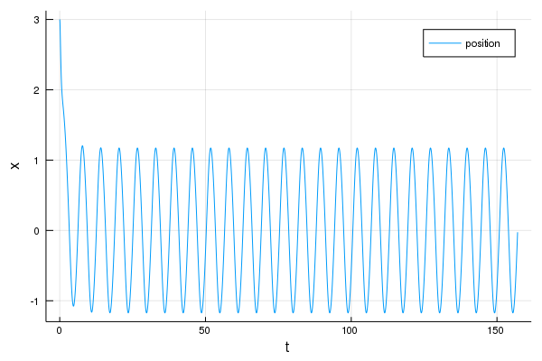
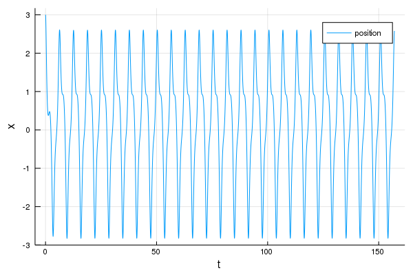
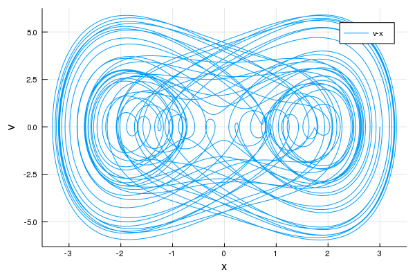
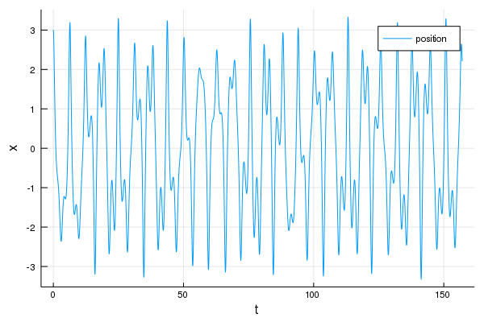

---
html:
    embed_local_images: true
    offline: true
    toc: true
---
# Project 2
## Code
@import "./Project_2.jl" {as=julia}
## 运行结果及分析
### Part A

>Figure 1 Part A

由图中我们可以清楚看出,该运动最后归于稳定解.
### Part B

> Figure 2 相图(B=7,b=6)

> Figure 3 位图(B=7,b=6)

> Figure 4 相图(B=7,b=0.6)

> Figure 5 位图(B=7,b=0.6)

> Figure 6 相图(B=7,b=0.01)

> Figure 7 位图(B=7,b=0.01)

> Figure 8 相图(B=10,b=0.05)

> Figure 9 位图(B=10,b=0.05)

我们可以看出除了(B,b)=(7,0.01)的组合为混沌情况之外,其余的组合均为稳定解.
而(B,b)=(10,0.05)为分叉.
### Part C
修改推导的时间间隔使得每个间隔相位变换为1°,同时设置总推导周期数为1000,每个庞加莱截面的点数为1000,最后所得结果为

>Figure 10 庞加莱截面