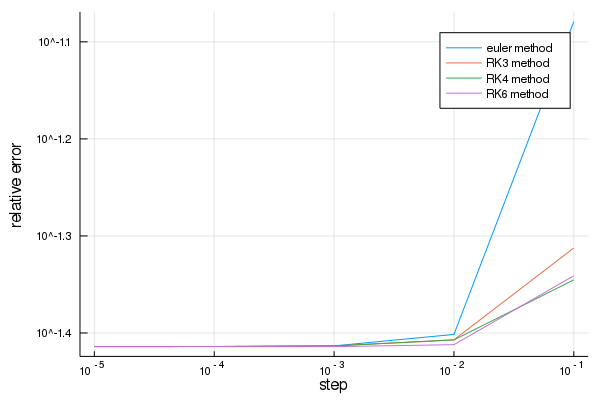
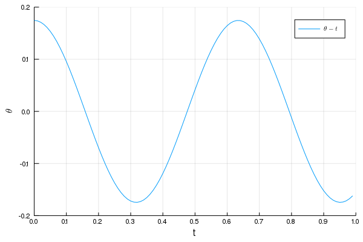
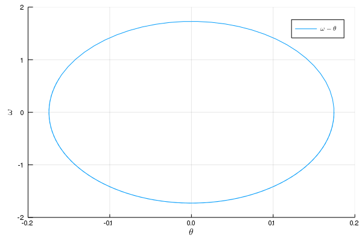
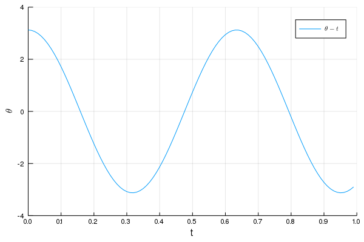
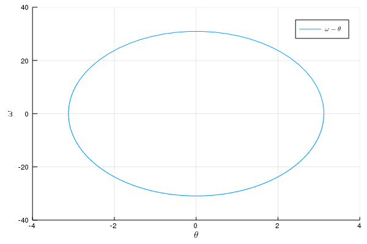

---
html:
    embed_local_images: true
    offline: true
    toc: true
---  
  
#  计算物理第十二次作业
  
>万国麟
>2017141221045
  
  
  
  
  
  
- [ 计算物理第十二次作业](#计算物理第十二次作业 )
  - [ Problem 1](#problem-1 )
    - [ Code](#code )
    - [ 运行结果及分析](#运行结果及分析 )
  - [ Problem 2](#problem-2 )
    - [ Code](#code-1 )
    - [ 运行结果及分析](#运行结果及分析-1 )
  
  
  
  
##  Problem 1
  
###  Code
  
所有RK方法定义在`RKs.jl`中
```julia
function ralston(dfunc,start,funcStart,step,stop)
    xs=range(start,stop=stop,step=step)
    ys=similar(xs)
    ys[1]=funcStart
    for i=2:length(xs)
        k1=dfunc(xs[i-1],ys[i-1])
        k2=dfunc(xs[i-1]+3/4*step,ys[i-1]+3/4*k1*step)
        ys[i]=ys[i-1]+(k1/3+2k2/3)step
    end
    return xs,ys
end
function RK3(dfunc,start,funcStart,step,stop)
    xs=range(start,stop=stop,step=step)
    ys=similar(xs)
    ys[1]=funcStart
    for i=2:length(xs)
        k1=dfunc(xs[i-1],ys[i-1])
        k2=dfunc(xs[i-1]+step/2,ys[i-1]+k1*step/2)
        k3=dfunc(xs[i-1]+step,ys[i-1]-step*k1+2step*k2)
        ys[i]=ys[i-1]+(k1+4k2+k3)/6*step
    end
    return xs,ys
end
function RK4(dfunc,start,funcStart,step,stop)
    xs=range(start,stop=stop,step=step)
    ys=similar(xs)
    ys[1]=funcStart
    for i=2:length(xs)
        k1=dfunc(xs[i-1],ys[i-1])
        k2=dfunc(xs[i-1]+step/2,ys[i-1]+k1*step/2)
        k3=dfunc(xs[i-1]+step/2,ys[i-1]+k2*step/2)
        k4=dfunc(xs[i-1]+step,ys[i-1]+k3*step)
        ys[i]=ys[i-1]+(k1+2k2+2k3+k4)/6*step
    end
    return xs,ys
end
function RK6(dfunc,start,funcStart,step,stop)
    xs=range(start,stop=stop,step=step)
    ys=similar(xs)
    ys[1]=funcStart
    for i=2:length(xs)
        k1=dfunc(xs[i-1],ys[i-1])
        k2=dfunc(xs[i-1]+step,ys[i-1]+step*k1)
        k3=dfunc(xs[i-1]+step/2,ys[i-1]+(3k1+k2)*step/8)
        k4=dfunc(xs[i-1]+2step/3,ys[i-1]+(8k1+2k2+8k3)*step/27)
        k5=dfunc(xs[i-1]+(7-sqrt(21))*step/14,ys[i-1]+(3(3sqrt(21)-7)k1-8(7-sqrt(21))k2+48(7-sqrt(21))k3-3(21-sqrt(21))k4)*step/329)
        k6=dfunc(xs[i-1]+(7+sqrt(21))*step/14,ys[i-1]+(-5(231+51sqrt(21))k1-40(7+sqrt(21))k2-320sqrt(21)k3+3(21+121sqrt(21))k4+392(6+sqrt(21))k5)*step/1960)
        k7=dfunc(xs[i-1]+step,ys[i-1]+(15(22+7sqrt(21))k1+120k2+40(7sqrt(21)-5)k3-63(3sqrt(21)-2)k4-14(49+9sqrt(21))k5+70(7-sqrt(21))k6)*step/180)
        ys[i]=ys[i-1]+(9k1+64k3+49k5+49k6+9k7)/180*step
    end
    return xs,ys
end
```  
Problem 1的主函数位于`Problem_1.jl`文件中
```julia
using Plots;gr()
using CurveFit
  
include("RKs.jl")
  
function err(i)
    dfunc(x,y)=1-x+4y
    func(x)=(4exp(-4x)-3exp(-4x)+19)/(16exp(-4x))
    xs,ys=ralston(dfunc,0,1,10.0^(-i),1)
    plot(xs,ys,label="ralston's method")
    laws=func.(xs)
    plot!(xs,laws,label="accurate values")
    err1=abs.(laws-ys)./laws
    xs,ys=RK3(dfunc,0,1,10.0^(-i),1)
    plot!(xs,ys,label="RK3 method")
    err2=abs.(laws-ys)./laws
    xs,ys=RK4(dfunc,0,1,10.0^(-i),1)
    plot!(xs,ys,label="RK4 method")
    err3=abs.(laws-ys)./laws
    xs,ys=RK6(dfunc,0,1,10.0^(-i),1)
    plot!(xs,ys,label="RK6 method")
    err4=abs.(laws-ys)./laws
    png(joinpath(@__DIR__,"results/Problem_1_$i.png"))
    return sum(err1)/length(err1),sum(err2)/length(err2),sum(err3)/length(err3),sum(err4)/length(err4)
end
function main()
    errR=zeros(5)
    errRK3=zeros(5)
    errRK4=zeros(5)
    errRK6=zeros(5)
    for i=1:5
        errR[i],errRK3[i],errRK4[i],errRK6[i]=err(i)
    end
    steps=[10.0^(-i) for i=1:5]
    plot(steps,errR,label="euler method",xscale=:log10,yscale=:log10,xlabel="step",yticks=[10.0^(i/10) for i=-20:0],ylabel="relative error")
    plot!(steps,errRK3,label="RK3 method")
    plot!(steps,errRK4,label="RK4 method")
    plot!(steps,errRK6,label="RK6 method")
    print("The power of ralston's Method is ",power_fit(steps,errR)[2],"\n")
    print("The power of RK3 is ",power_fit(steps,errRK3)[2],"\n")
    print("The power of RK4 is ",power_fit(steps,errRK4)[2],"\n")
    print("The power of RK6 is ",power_fit(steps,errRK6)[2],"\n")
    png(joinpath(@__DIR__,"Problem_1.png"))
end
main()
```  
###  运行结果及分析
  
>The power of ralston's Method is 0.06823235351444805
>The power of RK3 is 0.021007994222425833
>The power of RK4 is 0.01443486567025812
>The power of RK6 is 0.014797723980276612
  
输出图像如下

>Figure 1 RK方法们的误差与步长的关系
  
此处所得相对误差与步长的幂次不应为大于一.
##  Problem 2
  
###  Code
  
```julia
using Plots;gr()
using LaTeXStrings
  
function RK4(dfunc,r,t,step)
    k1=dfunc(t,r)
    k2=dfunc(t+step/2,r.+k1*step/2)
    k3=dfunc(t+step/2,r.+k2*step/2)
    k4=dfunc(t+step,r.+k3*step)
    rn=r.+(k1.+2k2.+2k3.+k4)/6*step
    return rn
end
  
function func(t,r)
    g,L=9.81,0.1
    theta,omega=r
    fTheta=omega
    fOmega=-g/L*theta
    return [fTheta,fOmega]
end
  
function run(rawDeg,rawOmega)
    step=10^(-2)
    t=Array(range(0,1,step=step))
    r=[deg2rad(rawDeg),rawOmega]
    thetaPoints=[]
    omegaPoints=[]
    for time in t
        thetaPoints=vcat(thetaPoints,r[1])
        omegaPoints=vcat(omegaPoints,r[2])
        r=RK4(func,r,time,step)
    end
    plot(t,thetaPoints,label=L"\theta-t",xlabel="t",ylabel=L"\theta",lims=:round,xticks=0:0.1:1)
    png(joinpath(@__DIR__,"Problem_2_position_$rawDeg.png"))
    plot(thetaPoints,omegaPoints,label=L"\omega - \theta",xlabel=L"\theta",ylabel=L"\omega",lims=:round)
    png(joinpath(@__DIR__,"Problem_2_phase_$rawDeg.png"))
end
function main()
    run(10,0)
    run(179,0)
end
main()
```  
###  运行结果及分析
  

>Figure 2 当初始角度为10°时的图像
  

>Figure 3 当初始角度为10°时的图像
  

>Figure 4 当初始角度为179°时的图像
  

>Figure 5 当初始角度为179°时的图像
  
---
Project 2的文档位于[这里](Project_2.md )
  