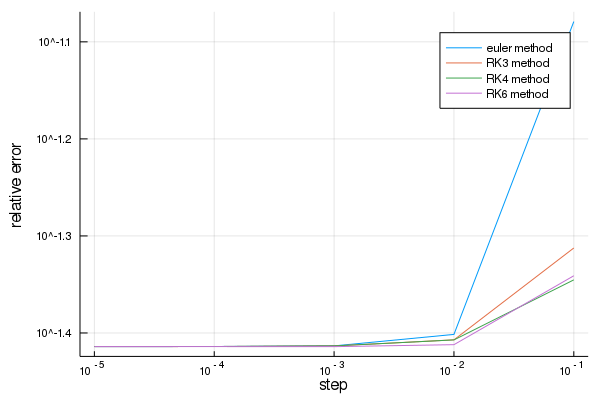
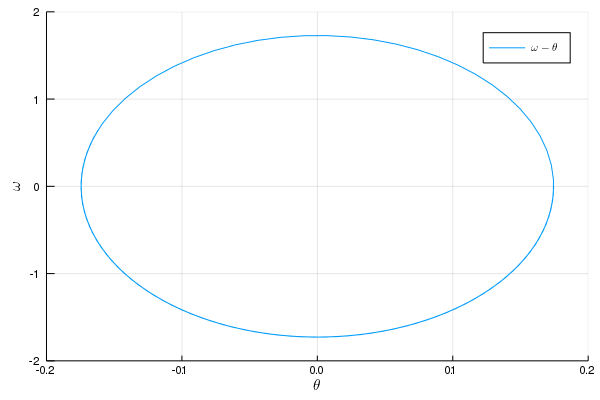
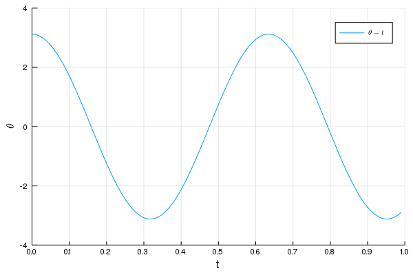

---
html:
    embed_local_images: true
    offline: true
    toc: true
---
# 计算物理第十二次作业
>万国麟
>2017141221045

<!-- @import "[TOC]" {cmd="toc" depthFrom=1 depthTo=6 orderedList=false} -->

<!-- code_chunk_output -->

- [ 计算物理第十二次作业](#计算物理第十二次作业)
  - [ Problem 1](#problem-1)
    - [ Code](#code)
    - [ 运行结果及分析](#运行结果及分析)
  - [ Problem 2](#problem-2)
    - [ Code](#code-1)
    - [ 运行结果及分析](#运行结果及分析-1)

<!-- /code_chunk_output -->

## Problem 1
### Code
所有RK方法定义在`RKs.jl`中
@import "./RKs.jl" {as=julia}
Problem 1的主函数位于`Problem_1.jl`文件中
@import "./Problem_1.jl" {as=julia}
### 运行结果及分析
>The power of ralston's Method is 0.06823235351444805
>The power of RK3 is 0.021007994222425833
>The power of RK4 is 0.01443486567025812
>The power of RK6 is 0.014797723980276612

输出图像如下

>Figure 1 RK方法们的误差与步长的关系

此处所得相对误差与步长的幂次不应为大于一.
## Problem 2
### Code
@import "./Problem_2.jl" {as=julia}
### 运行结果及分析

>Figure 2 当初始角度为10°时的$\theta-t$图像

>Figure 3 当初始角度为10°时的$\omega-\theta$图像

>Figure 4 当初始角度为179°时的$\theta-t$图像

>Figure 5 当初始角度为179°时的$\omega-\theta$图像

---
Project 2的文档位于[这里](Project_2.md)