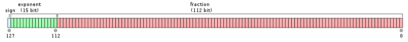

---
html:
    embed_local_images: true
    offline: true
    toc: true
---
# 计算物理的第二次作业 {ignore=true}

>万国麟
>2017141221045


<!-- @import "[TOC]" {cmd="toc" depthFrom=1 depthTo=6 orderedList=false} -->

<!-- code_chunk_output -->

* [Problem 1](#problem-1)
	* [Code](#code)
	* [结果](#结果)
* [Problem 2](#problem-2)
	* [Code](#code-1)
	* [结果](#结果-1)
* [分析](#分析)

<!-- /code_chunk_output -->

## Problem 1
### Code
代码如下，保存在`Problem_1.c`中
```c
#include "stdio.h"
#include "math.h"
#include "time.h"
//用于计时的模块
double getTime(time_t stage1,time_t stage2){
    return (double)(stage2-stage1)/CLOCKS_PER_SEC;
}
//计算求和项的函数
float ser(index){
    return 1.0/(2*index-1);
}
//正向求和函数
float posSum(){
    float Sum=0;
    for(size_t i=1;i<=5*(int)pow(10,8);i++) //用5*10**8来进行次数判断
    {
        if (i%2==0) {
            Sum-=ser(i);
        }
        else
        {
            Sum+=ser(i);
        }   
    }
    return Sum;
}
//逆向求和函数
float resSum(){
    float Sum=0;
    for(size_t i=5*(int)pow(10,8);i>0;i--)  //用5*10**8来进行次数判断
    {
        if (i%2==0) {
            Sum-=ser(i);
        }
        else
        {
            Sum+=ser(i);
        }   
    }
    return Sum;
}
//主函数
void main(){
    time_t start=clock();
    float posResult,resResult;
    posResult=4*posSum();
    printf("正向求和结果为：%.10f \n",posResult);
    time_t stage1=clock();
    resResult=4*resSum();
    printf("逆向求和结果为：%.10f \n",resResult);
    time_t stage2=clock();
    printf("第一段的时间为：%f\n",getTime(start,stage1));
    printf("第二段的时间为：%f\n",getTime(stage1,stage2));
    printf("总时间消耗为：%f\n",getTime(start,stage2));
}
```
### 结果
输出结果如下
>正向求和结果为：3.1415967941 
>逆向求和结果为：3.1415925026 
>第一段的时间为：1.704763
>第二段的时间为：1.680130
>总时间消耗为：3.384893

## Problem 2
### Code
代码如下，保存在`Problem_2.c`中，编译时**必须加上`-lquadmath`参数**
```c
#include "quadmath.h"
#include "stdio.h"
#include "time.h"
//用于计时的模块
double getTime(time_t stage1,time_t stage2){
    return (double)(stage2-stage1)/CLOCKS_PER_SEC;
}
//得到arctan的一项
__float128 arctanSer(__float128 num,int index) {
    int flag;
    if (index%2==0) {
        flag=-1;
    }
    else {
        flag=1;
    }
    return flag*powq(num,2*index-1)/(2*index-1);
}
//得到求和项的函数
__float128 getBase(int index) {
    __float128 f_1,f_5,f_239,par1,par2;
    f_1=1.0Q;
    f_5=5.0Q;
    f_239=239.0Q;
    par1=f_1/f_5;
    par2=f_1/f_239;
    return 4*arctanSer(par1,index)-arctanSer(par2,index);
}
//主函数
void main() {
    time_t start=clock();
    int index=1;
    char piStr[102];
    __float128 base,numSum=0.0Q,pi;
    base=getBase(index);
    while (fabsq(base)>powq(10,-100)) { //使用精度作为退出条件
        numSum+=base;
        index++;
        base=getBase(index);
    }
    pi=4*numSum;
    quadmath_snprintf(piStr,sizeof piStr,"%*.100Qe",pi);
    printf("所得Pi值为：\n%s \n",piStr);
    time_t end=clock();
    printf("总时间消耗为：%f \n",getTime(start,end));
}
```
### 结果
输出结果如下
>所得Pi值为：
>3.141592653589793238462643383279502412293079220690124961808915814888833011042645892985092359595000743 
>总时间消耗为：0.001331

## 分析
在Problem 1中，对于C语言的`float`类型数据而言，由于在机器中的浮点数是通过二进制来离散表示的，而`float`在计算机中的表示形式如下图


其中：
* sign部分为符号位（1bit）
* exponent部分为幂次位（8bit）
* fraction部分为小数部分（23bit）

由此可见，对于一个`float`类型的数据而言，其能表示的最小的十进制数为$2^{-23}=0.00000011920928955078125$，对于比这一间隔更小的数则无能为力。可见对于单精度的数据，其最小的“分辨率”即为$10^{-7}$。考虑到其表示方式，则可以得到`float`真正的精确的位数为**从左侧第一个非零位开始至第七位**。[^1]
同理对于`__float128`类型的数据，精确地位数为从**左侧第一个非零位开始至第三十四位**，因其数据结构表示如下图。



这与Problem 1、Problem 2中计算所得的$\pi$值与标准值相比产生误差的位数也是一致的。
>Problem 1（取逆向求和的结果）：
>3.141592**5**026
>//第八位开始误差
>Problem 2：
>3.141592653589793238462643383279502**4**12293079220690124961808915814888833011042645892985092359595000743
>//第三十五位开始误差
>标准值：
>3.1415926535897932384626433832795028841971693993751058209749445923078164062862089986280348253421170679
>//以上结果中**加粗数字**为出现错误的位置

而分析在Problem 1中正向求和与逆向求和结果不同的问题。如果求和顺序为从大加到小（即上文所说的正向求和）时，由于大数的浮点位数要高，初期大数求和所得数字的与最终所加小数的浮点位数差值更大，其与小数求和时将较小数字尾舍弃较多导致最后求和的误差较大；而如果求和顺序为从小加到大，初期小数的浮点位接近所以求和过程产生的误差较小，而经过小数求和所得和的浮点位数与最终的大数浮点位数也会相近，进而进一步减小了对于数字舍弃产生的误差。[^2]

[^1]:https://blog.csdn.net/dreamer2020/article/details/24158303
[^2]:https://akaedu.github.io/book/ch14s04.html