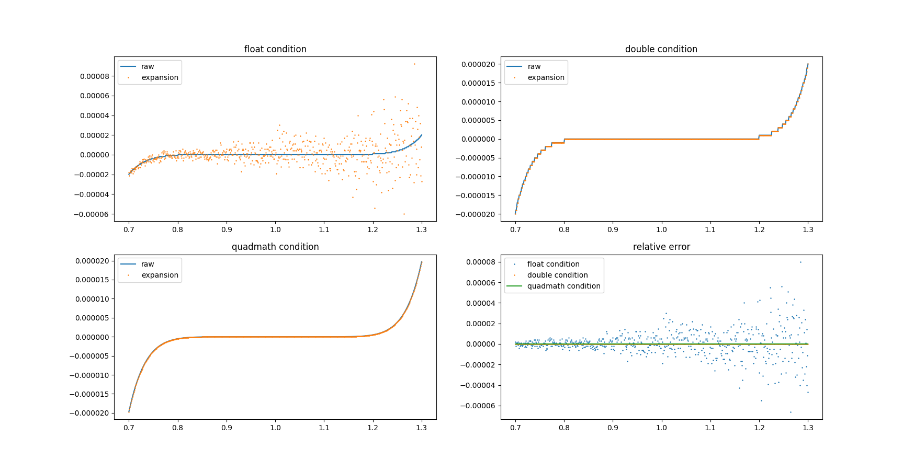

---
html:
    embed_local_images: true
    offline: true
    toc: true
---
# 计算物理第三次作业

> 万国麟
> 2017141221045

<!-- @import "[TOC]" {cmd="toc" depthFrom=1 depthTo=6 orderedList=false} -->

<!-- code_chunk_output -->

- [计算物理第三次作业](#%E8%AE%A1%E7%AE%97%E7%89%A9%E7%90%86%E7%AC%AC%E4%B8%89%E6%AC%A1%E4%BD%9C%E4%B8%9A)
  - [Problem 1](#problem-1)
    - [Code](#code)
      - [C部分](#c%E9%83%A8%E5%88%86)
      - [Python部分](#python%E9%83%A8%E5%88%86)
      - [Shell部分](#shell%E9%83%A8%E5%88%86)
    - [结果及分析](#%E7%BB%93%E6%9E%9C%E5%8F%8A%E5%88%86%E6%9E%90)
  - [Problem 2](#problem-2)
    - [Code](#code-1)
      - [Expansion](#expansion)
        - [C部分](#c%E9%83%A8%E5%88%86-1)
        - [Python部分](#python%E9%83%A8%E5%88%86-1)
        - [Shell部分](#shell%E9%83%A8%E5%88%86-1)
      - [Horner's Method](#horners-method)
        - [C部分](#c%E9%83%A8%E5%88%86-2)
        - [Python部分](#python%E9%83%A8%E5%88%86-2)
        - [Shell部分](#shell%E9%83%A8%E5%88%86-2)
    - [结果及分析](#%E7%BB%93%E6%9E%9C%E5%8F%8A%E5%88%86%E6%9E%90-1)

<!-- /code_chunk_output -->

## Problem 1
### Code
该部分代码分为三块
1. 用于快速生产数据的C语言部分
2. 用于便捷绘图的Python部分
3. 用于前两个模块的进行与数据互通的Shell部分

运行时只需运行`Problem_1.sh`即可完成所有工作
下面分别展示各个部分的代码
#### C部分
<details>
<summary>源码</summary>

```c
#include "stdio.h"
#include "math.h"
#include "stdbool.h"

double err(int index, bool normalize) {
    int b;
    b=(int)pow(10,index);
    double r;
    r=sqrt(b*b-4);
    float x;
    if (normalize) {
        x=2/(r+b);
    }
    else {
        x=(b-r)/2;
    }
    double std;
    std=2/(r+b);
    double err;
    err=(x-std)/std*100;
    return err;
}
void main() {
    printf("normalize之前：\n");
    bool flag=false;
    for(size_t i=2;i<6;i++)
    {
        printf("当b的值为 %d 时，相对误差为 %e %%\n",(int)pow(10,i),err(i,flag));
    }
    flag=true;
    printf("normalize之前：\n");
    for(size_t i=2;i<6;i++)
    {
        printf("当b的值为 %d 时，相对误差为 %e %%\n",(int)pow(10,i),err(i,flag));
    }
}
```
</details>

#### Python部分
<details>
<summary>源码</summary>

```python
import re
from os import path
import matplotlib.pyplot as plt

def getList():
    dirPath=path.dirname(path.abspath(__file__))
    filePath=dirPath+"/Problem_1.txt"
    with open(filePath,"r") as f:
        rawStrList=f.readlines()
    rawList=[]
    for line in rawStrList:
        flag=re.search("当",line)
        if flag is not None:
            num=float(line.split()[-2])
            if num>1:
                num=10**(-4)
            rawList.append(num)
    return rawList
X=[10**i for i in range(2,6)]
Y=getList()
Y1=Y[:4]
Y2=Y[4:]
plt.plot(X,Y1,"x-",label="before normalization")
plt.plot(X,Y2,"+-",label="after normalization")
plt.legend()
plt.xscale("log")
plt.show()
```
</details>

#### Shell部分
```bash
#!/usr/bin/env bash

appPath="./Problem_1"
if [ ! -a  $appPath ]; then
    gcc ./Problem_1.c -o $appPath -lm
fi
filePath="./Problem_1.txt"
if [ ! -a  $filePath ]; then
    $appPath > $filePath
fi
python ./Problem_1.py
```

### 结果及分析
最终得到的误差分布图如下


>Figure 1 误差分布图

可以看出标准化之前之后均相对标准值（这里使用双精度计算的标准化之后的值作为标准值），标准化之前的值在数量级较小时误差与标准化之后的值的误差相差不大，但随着数量级的不断扩大，标准化之后的值误差较小而标准化之前的值则相对于标准值的误差逐渐扩大。
这是因为标准化之前的计算公式
$$x=\frac{r-b}{2}$$
在$r$与$b$之间差距较小时，会因为float的有效位数有限而导致做差结果位于有效位数之外产生较大误差。同时浮点数之间的除法运算也赋予了这个公式固有的误差。
但对于标准化之后的计算公式
$$x=\frac{2}{b+r}$$
而言，虽然仍有浮点数除法运算的固有误差，但消除了数值相近浮点数做差产生的大量误差，有助于计算精度的提高。

## Problem 2
### Code
与Problem 1相同，分为三个文件。但分为使用Expansion和使用Horner's Method两部分。
分别运行`Problem_2.sh`和`horner.sh`来获取结果。
#### Expansion
##### C部分
<details>
<summary>源码</summary>

```c
#include "stdio.h"
#include "quadmath.h"
#include "math.h"

int cof[10]={-1,9,-36,84,-126,126,-84,36,-9,1};

float f_compute(int choice,float x) {
    float result=0;
    if (choice) {
        result+=powf(x-1,9);
    }
    else {
        for(size_t i=0;i<9;i++) {
            result+=cof[i]*powf(x-1,i);
        }
    }
    return result;
}
double d_compute(int choice,double x) {
    double result=0;
    if (choice) {
        result+=pow(x-1,9);
    }
    else {
        for(size_t i=0;i<9;i++) {
            result+=cof[i]*pow(x-1,i);
        }
    }
    return result;
}
__float128 q_compute(int choice,__float128 x) {
    __float128 result=0;
    if (choice) {
        result+=powq(x-1,9);
    }
    else {
        for(size_t i=0;i<9;i++) {
            result+=cof[i]*powq(x-1,i);
        }
    }
    return result;
}

void main() {
    float f_temp,f_0_result,f_1_result;
    double d_temp,d_0_result,d_1_result;
    __float128 q_temp;
    char quadStr_0[25],quadStr_1[25];
    for(size_t i=700;i<=1300;i++) {
        f_temp=(float)i/1000;
        d_temp=(double)i/1000;
        q_temp=(__float128)i/1000;
        f_1_result=f_compute(1,f_temp);
        f_0_result=f_compute(0,f_temp);
        d_1_result=d_compute(1,d_temp);
        d_0_result=d_compute(0,d_temp);
        quadmath_snprintf(quadStr_1,sizeof quadStr_1,"%Qe",q_compute(1,q_temp));
        quadmath_snprintf(quadStr_0,sizeof quadStr_0,"%Qe",q_compute(0,q_temp));
        printf("%f %f %f %f %f %s %s\n",f_temp,f_1_result,f_0_result,d_1_result,d_0_result,quadStr_1,quadStr_0);
    }
}
```
</details>

##### Python部分 
<details>
<summary>源码</summary>

```python
from os import path
import matplotlib.pyplot as plt
from numpy import empty,array,vstack

dirPath=path.dirname(path.abspath(__file__))
filePath=dirPath+"/Problem_2.txt"

with open(filePath,"r") as f:
    strLists=f.readlines()
numArray=empty((0,7),float)
for line in strLists:
    numList=list(map(float,line.split()))
    numArray=vstack((numArray,array(numList)))
X=numArray[:,0]
f_raw=numArray[:,1]
f_exp=numArray[:,2]
d_raw=numArray[:,3]
d_exp=numArray[:,4]
q_raw=numArray[:,5]
q_exp=numArray[:,6]
f_re_err=(f_raw-q_exp)/q_exp
d_re_err=(d_raw-q_exp)/q_exp
q_re_err=(q_raw-q_exp)/q_exp
plt.close('all')
plt.figure()
plt.subplot(221)
plt.title("float condition")
plt.plot(X,f_raw,"-",label="raw")
plt.plot(X,f_exp,"-",label="expansion")
plt.legend()
plt.subplot(222)
plt.title("double condition")
plt.plot(X,d_raw,"-",label="raw")
plt.plot(X,d_exp,"-",label="expansion")
plt.legend()
plt.subplot(223)
plt.title("quadmath condition")
plt.plot(X,q_raw,"-",label="raw")
plt.plot(X,q_exp,"-",label="expansion")
plt.legend()
plt.subplot(224)
plt.title("relative error")
plt.plot(X,f_re_err,"-",label="float condition")
plt.plot(X,d_re_err,"-",label="double condition")
plt.plot(X,q_re_err,"-",label="quadmath condition")
plt.legend()
plt.show()

```
</details>

##### Shell部分
```bash
#!/usr/bin/env bash

appPath="./Problem_2"
if [ ! -a  $appPath ]; then
    gcc ./Problem_2.c -o $appPath -lm -lquadmath
fi
filePath="./Problem_2.txt"
if [ ! -a  $filePath ]; then
    $appPath > $filePath
fi
python ./Problem_2.py
```

#### Horner's Method
##### C部分
<details>
<summary>源码</summary>

```c
#include "stdio.h"
#include "math.h"

int cof[9]={-9,36,-84,126,-126,84,-36,9,-1};

double ser(double index) {
    double power;
    power=1;
    for (size_t i=0;i<9;i++) {
        power*=index;
        power+=cof[i];
    }
}
void main() {
    for(size_t i=7000;i<=13000;i++) {
        double index,power;
        index=(double)i/10000;
        power=ser(index);
        printf("%f %.30f\n",index,power);
    }
}
```
</details>

##### Python部分
<details>
<summary>源码</summary>

```python
from os import path
import matplotlib.pyplot as plt
from numpy import empty,array,vstack

dirPath=path.dirname(path.abspath(__file__))
filePath=dirPath+"/horner.txt"

with open(filePath,"r") as f:
    strLists=f.readlines()
numArray=empty((0,2),float)
for line in strLists:
    numList=list(map(float,line.split()))
    numArray=vstack((numArray,array(numList)))
X=numArray[:,0]
result=numArray[:,1]
plt.figure()
plt.title("The result of Horner's Method")
plt.plot(X,result,"-",label="result")
plt.legend()
plt.show()
```
</details>

##### Shell部分
```bash
#!/usr/bin/env bash

appPath="./horner"
if [ ! -a  $appPath ]; then
    gcc ./horner.c -o $appPath -lm -lquadmath
fi
filePath="./horner.txt"
if [ ! -a  $filePath ]; then
    $appPath > $filePath
fi
python ./horner.py
```

### 结果及分析
最后所得使用Expansion的结果如下



>Figure 2 三种情况下各自Expansion的结果与最终的相对误差

使用Horner's Method的结果如下


>Figure 3 Horner's Method的结果

使用秦九韶算法来进行多项式值的计算结果更接近多项式的真实值，同时能够加快程序的运行速度。
因为秦九韶算法通过最大程度的使用乘法分配律来将大多数的乘法计算转换成加法计算，而对于计算机二样加法计算的速度要比乘法快得多同时误差也要小，这样一来既减少了计算的时间又提高了结果的精度。