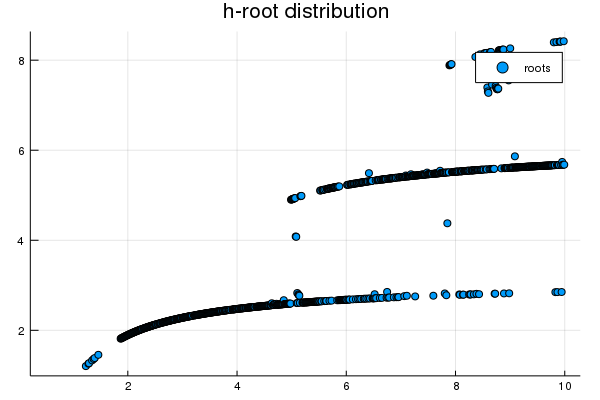

---
html:
    embed_local_images: true
    offline: true
    toc: true
---
# 计算物理第五次作业 {ignore=true}

> 万国麟
> 2017141221045

<!-- @import "[TOC]" {cmd="toc" depthFrom=1 depthTo=6 orderedList=false} -->

<!-- code_chunk_output -->

- [计算物理第五次作业 {ignore=true}](#%E8%AE%A1%E7%AE%97%E7%89%A9%E7%90%86%E7%AC%AC%E4%BA%94%E6%AC%A1%E4%BD%9C%E4%B8%9A-ignoretrue)
	- [Brent Method](#brent-method)
		- [Code](#code)
		- [作用分析](#%E4%BD%9C%E7%94%A8%E5%88%86%E6%9E%90)
	- [Problem 1](#problem-1)
		- [Code](#code-1)
		- [结果及分析](#%E7%BB%93%E6%9E%9C%E5%8F%8A%E5%88%86%E6%9E%90)
	- [Problem 2](#problem-2)
		- [Code](#code-2)
		- [结果及分析](#%E7%BB%93%E6%9E%9C%E5%8F%8A%E5%88%86%E6%9E%90-1)
	- [Problem 3](#problem-3)
		- [Part A](#part-a)
			- [Code](#code-3)
			- [结果及分析](#%E7%BB%93%E6%9E%9C%E5%8F%8A%E5%88%86%E6%9E%90-2)
		- [Part B](#part-b)
			- [Code](#code-4)
			- [结果及分析](#%E7%BB%93%E6%9E%9C%E5%8F%8A%E5%88%86%E6%9E%90-3)
		- [Part C](#part-c)
			- [Code](#code-5)
			- [结果及分析](#%E7%BB%93%E6%9E%9C%E5%8F%8A%E5%88%86%E6%9E%90-4)

<!-- /code_chunk_output -->

## Brent Method
### Code
代码如下
@import "./Brent.jl" {as="julia"}
### 作用分析
`Find`函数为整个文件的主体，可以用于制定函数、指定求解宽度、指定误差范围、指定求解起点的求解过程。其求解过程调用`Step`函数来使用”IQI“方法来进行迭代，同时调用`Change`函数来进行求解端点的迭代（采用迭代距离最远点的方法），使用该种方法可以保证迭代所用函数零点的确定性与唯一性，同时使用二次函数迭代也加速了收敛速度。
## Problem 1
### Code
代码如下
@import "./Problem_1.jl" {as="julia}
### 结果及分析
程序运行结果如下（其中计时部分已经多次计时刨除编译所需时间）
```
0.45018361129449697
  0.090180 seconds (229.23 k allocations: 11.794 MiB)
  0.413546 seconds (456.06 k allocations: 18.861 MiB, 1.44% gc time)
```
该结果是$f(x)=x \tan x-\sqrt{h^{2}-x^{2}}$在$x>0$条件下的零点，分析函数具体性质我们易知该函数为**偶函数**，所以**另一零点为所得零点的相反数**，所以最终求解结果为
$$x_{0}=\pm0.45018361129449697$$
同时对于$g(x)$而言，其根与h取值的分布图如下

>Figure 1 根与h取值的关系

## Problem 2
### Code
代码如下
@import "./Problem_2.jl" {as="julia"}
### 结果及分析
程序运行结果如下（其中计时部分已经多次计时刨除编译所需时间）
```
  0.074799 seconds (262.04 k allocations: 14.062 MiB)
3.2604507159502846e8
```
此处`tolerance`的值较大是因为对于天文学问题本身，以及所给数值有效位数的原因，将此值设置较低无任何意义，在影响收敛速度的同时也会影响求解的最终结果，容易得到无意义收敛点。
最终所得拉格朗日点对应的半径为
$$r=3.260\times10^{8}m$$
## Problem 3
### Part A
#### Code
代码如下
@import "./Problem_3/Plot.jl" {as="julia"}
#### 结果及分析
程序所需时间为（已经多次计时刨除编译所需时间）
```
  0.473440 seconds (681.08 k allocations: 35.811 MiB, 2.55% gc time)
```
输出图像为

>Figure 2 Ploynomial

由此图我们可以看出所求六零点分别所在的大概区间，为我们Part B中进行迭代求根提供了方便
### Part B
#### Code
代码如下
@import "./Problem_3/FindingRoots.jl" {as="julia"}
#### 结果及分析
程序所得结果为（其中计时部分已经多次计时刨除编译所需时间）
```
  0.192234 seconds (493.14 k allocations: 25.263 MiB, 5.05% gc time)
6-element Array{Float64,1}:
 0.033765238771256034
 0.16939530676596684 
 0.38069040695834594 
 0.6193095930416012  
 0.8306046932340159  
 0.9662347612287352
```
所以方程$924 x^{6}-2772 x^{5}+3150 x^{4}-1680 x^{3}+420 x^{2}-42 x+1=0$的解为
$$\left\{
\begin{aligned}
x_{1}&=&0.0337652388\\
x_{2}&=&0.1693953068\\
x_{3}&=&0.3806904070\\
x_{4}&=&0.6193095930\\
x_{5}&=&0.8306046932\\
x_{6}&=&0.9662347612\\
\end{aligned}
\right.$$
### Part C
#### Code
代码如下
@import "./Problem_3/FindingAllRoots.jl" {as="julia"}
#### 结果及分析
结果如下
```
  0.164669 seconds (490.05 k allocations: 25.131 MiB, 2.70% gc time)
6-element Array{Float64,1}:
 0.03376524289842399
 0.16939530676686765
 0.38069040687784345
 0.6193095930415956 
 0.8306046932331417 
 0.9662347571015799
```
可以看出在未实现通过绘图确定根大概范围的情况下仍然可以得出精确的解