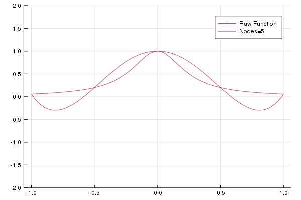
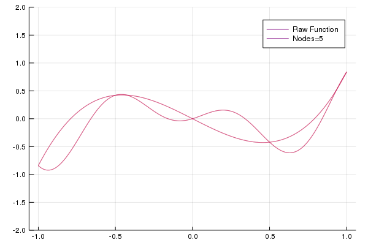

---
html:
    embed_local_images: true
    offline: true
    toc: true
---  
  
# 计算物理第六次作业
  
  
> 万国麟
> 2017141221045
  
  
  
  
  
* [计算物理第六次作业](#计算物理第六次作业 )
	* [拉格朗日插值法](#拉格朗日插值法 )
		* [Code](#code )
		* [分析](#分析 )
	* [Problem 1](#problem-1 )
		* [Code](#code-1 )
		* [结果及分析](#结果及分析 )
	* [Problem 2](#problem-2 )
		* [Code](#code-2 )
		* [结果及分析](#结果及分析-1 )
	* [Problem 3](#problem-3 )
		* [Code](#code-3 )
		* [结果及分析](#结果及分析-2 )
  
  
  
  
## 拉格朗日插值法
  
### Code
  
```julia
function Basis(x::Float64,index::UInt8,X::Array{Float64})
    result::Float64=1
    for i in X
        i!=X[index] && (result*=(x-i)/(X[index]-i);true)
    end
    return result
end
function L(x::Float64,X::Array{Float64},Y::Array{Float64})
    temp=similar(X)
    for i::UInt8=1:length(X)
        temp[i]=Y[i]*Basis(x,i,X)
    end
    result=sum(temp)
    return result
end
function Plot(nodes::UInt8,func::Function)
    X::Array{Float64}=LinRange(-1,1,nodes)
    Y=similar(X)
    Y.=func.(X)
  
    x::Array{Float64}=LinRange(-1,1,10000)
    y_P=similar(x)
    y_N=similar(x)
    y_N.=func.(x)
  
    Threads.@threads for i=1:length(x)
        y_P[i]=L(x[i],X,Y)
    end
  
    y=[y_N,y_P]
    labels=["Raw Function","Nodes=$nodes"]
    colors=[:purple,:red]
    plot(x,y,label=labels,color=colors,ylims=(-2,2),yticks=-2:0.5:2)
end
```  
### 分析
  
该文件为拉格朗日插值法的主要实现部分，其中`Basis`函数的作用是返回第`index`个点对应的差值基函数的函数值，`L`函数的作用是调用`Basis`函数来返回插值函数值，而`Plot`函数是Problem 2和Problem 3用于绘制gif动画的部分。
## Problem 1
  
### Code
  
```julia
using Plots;gr()
  
include("Lagrange.jl")
  
function Liner(x::Float64,X::Array{Float64},Y::Array{Float64})
    here::UInt8=1
  
    for i=1:length(X)-1
        X[i]<x && X[i+1]>=x && (here=i;true)
    end
  
    y::Float64=Y[here+1]+(Y[here]-Y[here+1])*(x-X[here+1])/(X[here]-X[here+1])
    return y
end
function main()
    X::Array{Float64}=[-1,0,1.27,2.55,3.82,4.92,5.02]
    Y::Array{Float64}=[-14.58,0,0,0,0,0.88,11.17]
  
    x::Array{Float64}=LinRange(-1,5.02,10000)
    y_l=similar(x)
    y_p=similar(x)
  
    Threads.@threads for i=1:length(x)
        y_l[i]=Liner(x[i],X,Y)
        y_p[i]=L(x[i],X,Y)
    end
  
    y=[y_l,y_p]
    labels=["Piecewise interpolation","Lagrange interpolation"]
    plot(x,y,label=labels)
    png(joinpath(@__DIR__,"Problem_1.png"))
end
  
@time main()
```  
### 结果及分析
  
程序输出结果如下
```
  0.976073 seconds (1.50 M allocations: 72.901 MiB, 2.79% gc time)
```

>Figure 1 分段线性插值与拉格朗日插值的结果
  
可见分段线性插值更符合实际情况
## Problem 2
  
### Code
  
```julia
using Plots;gr()
  
include("Lagrange.jl")
  
g(x::Float64)=1/(1+16x^2)
function main()
    anim=@animate for i::UInt8=5:21
        Plot(i,g)
    end
    gif(anim,joinpath(@__DIR__,"Problem_2.gif"),fps=1)
end
  
@time main()
```  
### 结果及分析
  
程序输出结果如下
```
┌ Info: Saved animation to 
└   fn = "/home/wapiti/on-the-fly/Computational_Physics/HW_6/Problem_2.gif"
  8.458516 seconds (8.87 M allocations: 399.642 MiB, 2.44% gc time)
Plots.AnimatedGif("/home/wapiti/on-the-fly/Computational_Physics/HW_6/Problem_2.gif")
```

>Figure 2 节点数量与拟合效果
  
由此我们可以看出，当取点数量过多（拟合次数过高）时拟合结果容易出现过拟合（龙格现象）。
## Problem 3
  
### Code
  
```julia
using Plots;gr()
  
include("Lagrange.jl")
  
g(x::Float64)=x*sin(2pi*x+1)
function main()
    anim=@animate for i::UInt8=5:21
        Plot(i,g)
    end
    gif(anim,joinpath(@__DIR__,"Problem_3.gif"),fps=1)
end
  
@time main()
```  
### 结果及分析
  
程序输出结果为
```
┌ Info: Saved animation to 
└   fn = "/home/wapiti/on-the-fly/Computational_Physics/HW_6/Problem_3.gif"
  8.913152 seconds (8.88 M allocations: 399.918 MiB, 2.70% gc time)
Plots.AnimatedGif("/home/wapiti/on-the-fly/Computational_Physics/HW_6/Problem_3.gif")
```

>Figure 3 节点数量与拟合效果
  