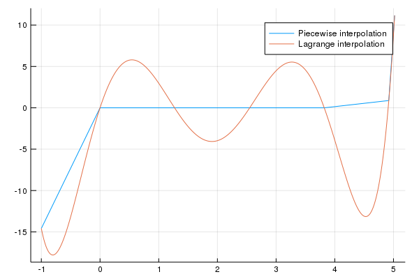

---
html:
    embed_local_images: true
    offline: true
    toc: true
---
# 计算物理第五次作业

> 万国麟
> 2017141221045

## 拉格朗日插值法
### Code
@import "./Lagrange.jl" {as="julia"}
### 分析
该文件为拉格朗日插值法的主要实现部分，其中`Basis`函数的作用是返回第`index`个点对应的差值基函数的函数值$Basis_{index}(x)$，`L`函数的作用是调用`Basis`函数来返回插值函数值$Lagrange(x)$，而`Plot`函数是Problem 2和Problem 3用于绘制gif动画的部分。
## Problem 1
### Code
@import "./Problem_1.jl" {as="julia"}
### 结果及分析
程序输出结果如下
```
  0.976073 seconds (1.50 M allocations: 72.901 MiB, 2.79% gc time)
```

>Figure 1 分段线性插值与拉格朗日插值的结果

可见分段线性插值更符合实际情况
## Problem 2
### Code
@import "./Problem_2.jl" {as="julia"}
### 结果及分析
程序输出结果如下
```
┌ Info: Saved animation to 
└   fn = "/home/wapiti/on-the-fly/Computational_Physics/HW_6/Problem_2.gif"
  8.458516 seconds (8.87 M allocations: 399.642 MiB, 2.44% gc time)
Plots.AnimatedGif("/home/wapiti/on-the-fly/Computational_Physics/HW_6/Problem_2.gif")
```

>Figure 2 节点数量与拟合效果

由此我们可以看出，当取点数量过多（拟合次数过高）时拟合结果容易出现过拟合（龙格现象）。
## Problem 3
### Code
@import "./Problem_3.jl" {as="julia"}
### 结果及分析
程序输出结果为
```
┌ Info: Saved animation to 
└   fn = "/home/wapiti/on-the-fly/Computational_Physics/HW_6/Problem_3.gif"
  8.913152 seconds (8.88 M allocations: 399.918 MiB, 2.70% gc time)
Plots.AnimatedGif("/home/wapiti/on-the-fly/Computational_Physics/HW_6/Problem_3.gif")
```

>Figure 3 节点数量与拟合效果