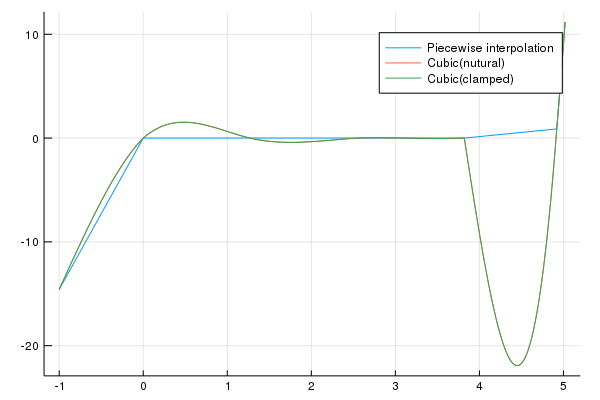
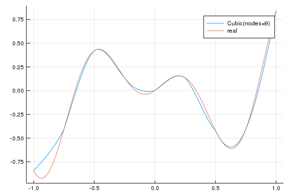

---
html:
    embed_local_images: true
    offline: true
    toc: true
---  
  
# 计算物理第七次作业
  
>万国麟
>2017141221045
  
  
  
  
  
* [插值函数](#插值函数 )
* [Problem 1](#problem-1 )
	* [Code](#code )
	* [运行结果](#运行结果 )
* [Problem 2](#problem-2 )
	* [Code](#code-1 )
	* [运行结果](#运行结果-1 )
* [Problem 3](#problem-3 )
	* [Code](#code-2 )
	* [运行结果](#运行结果-2 )
  
  
  
  
## 插值函数
  
```julia
@inbounds function Step(x::Array{Float64},index)
    index==length(x) && (return x[index]-x[index-1];true) || (return x[index+1]-x[index];true)
end
@inbounds function Thomas(u::Array{Float64},d::Array{Float64},l::Array{Float64},b::Array{Float64})
    c=similar(u)
    x=h=similar(d)
  
    for i=1:length(c)
        i==1 && (c[i]=u[i]/d[i];true) || (c[i]=u[i]/(d[i]-l[i-1]*c[i-1]);true)
    end
    for i=1:length(h)
        i==1 && (h[i]=b[i]/d[i];true) || (h[i]=(b[i]-l[i-1]*h[i-1])/(d[i]-l[i-1]*c[i-1]);true)
    end
  
    x[length(x)]=h[length(h)]
    for i=length(x)-1:1
        x[i]=h[i]-c[i]*x[i+1]
    end
    return x
end
@inbounds function FuncArray(x::Array{Float64},y::Array{Float64},m::Array{Float64})
    len=length(x)
  
    funcs=Array{Function}[]
    for i=1:len-1
        step=Step(x,i)
  
        a=y[i]
        b=(y[i+1]-y[i])/step-m[i]*step/2-(m[i+1]-m[i])*step/6
        c=m[i]/2
        d=(m[i+1]-m[i])/(6step)
  
        func(now)=a+b*(now-x[i])+c*(now-x[i])^2+d*(now-x[i])^3
        funcs=vcat(funcs,func)
    end
    return funcs
end
@inbounds function Cubic(x::Array{Float64},y::Array{Float64},clamped::Bool=true)
    len::UInt8=length(x)
    h=[x[i+1]-x[i] for i=1:len-1]
  
    d=[2*(h[i-1]+h[i]) for i=2:len-1]
    d=vcat(2h[1],d,2h[len-1])
    u=l=h
    if clamped
        d[1]=d[len]=1
        u[1]=l[len-1]=0
    end
  
    m=similar(x)
    b=zeros(Float64,len)
    for i=2:len-1
        b[i]=(y[i+1]-y[i])/Step(x,i)-(y[i]-y[i-1])/Step(x,i-1)
        b[i]*=6
    end
  
    m=Thomas(u,d,l,b)
    return FuncArray(x,y,m)
end
@inbounds function GetIndex(now::Float64,x::Array{Float64})
    for i=1:length(x)-1
        now>=x[i] && now<=x[i+1] && (return i;true)
    end
end
@inbounds function Produce(now::Float64,x::Array{Float64},funcs::Array{Function})
    index::UInt8=0
  
    index=GetIndex(now,x)
  
    return funcs[index](now)
end
  
#函数们的帮助文档们
@doc """
## 作用
使用追赶法（Thomas Method）来进行三对角矩阵方程的求解
## 参数
u→矩阵上层
d→矩阵中层
l→矩阵下层
b→常数向量
""" Thomas
```  
其中`Cubic`函数为总用于生成插值函数的函数，其调用的`FuncArray`函数为使用指定插值自变量，函数值以及求得的m值列表得到插值函数的函数。其中`Thomas`函数为用于求解三对角矩阵所用函数。`Produce`函数为给出所需插值点以及插值函数求得插值函数值的函数。
## Problem 1
  
### Code
  
```julia
using Plots;gr()
  
include("Cubic.jl")
  
function Liner(x::Float64,X::Array{Float64},Y::Array{Float64})
    here::UInt8=1
  
    for i=1:length(X)-1
        X[i]<x && X[i+1]>=x && (here=i;true)
    end
  
    y::Float64=Y[here+1]+(Y[here]-Y[here+1])*(x-X[here+1])/(X[here]-X[here+1])
    return y
end
function main()
    X::Array{Float64}=[-1,0,1.27,2.55,3.82,4.92,5.02]
    Y::Array{Float64}=[-14.58,0,0,0,0,0.88,11.17]
    funcs_n::Array{Function}=Cubic(X,Y,false)
    funcs_c::Array{Function}=Cubic(X,Y)
  
    x::Array{Float64}=LinRange(-1,5.02,10000)
    y_l=similar(x)
    y_cp=y_np=similar(x)
  
    for i=1:length(x)
        y_l[i]=Liner(x[i],X,Y)
        y_np[i]=Produce(x[i],X,funcs_n)
        y_cp[i]=Produce(x[i],X,funcs_c)
    end
  
    y=[y_l,y_np,y_cp]
    labels=["Piecewise interpolation","Cubic(natural)","Cubic(clamped)"]
    plot(x,y,label=labels)
    png(joinpath(@__DIR__,"Problem_1.png"))
end
  
main()
```  
### 运行结果
  
插值结果如下

>Figure 1 Problem_1
  
## Problem 2
  
### Code
  
```julia
using Plots;gr()
  
include("Cubic.jl")
  
f(x)=x*sin(2pi*x+1)
function main(nodes)
    X::Array{Float64}=LinRange(-1,1,nodes)
    Y::Array{Float64}=f.(X)
    clamped::Bool=false
  
    funcs::Array{Function}=Cubic(X,Y,clamped)
    #println("$funcs")
  
    x::Array{Float64}=LinRange(-1,1,1000)
    y_p=similar(x)
    y_t=f.(x)
  
    Threads.@threads for i=1:length(x)
        y_p[i]=Produce(x[i],X,funcs)
    end
  
    y=[y_p,y_t]
    labels=["Cubic(nodes=$nodes)","real"]
    plot(x,y,label=labels)
end
  
anim=@animate for nodes=9:21
    main(nodes)
end
gif(anim,joinpath(@__DIR__,"Problem_2.gif"),fps=1)
```  
### 运行结果
  

>Figure 2 Problem_2
  
## Problem 3
  
### Code
  
```julia
using Plots;gr()
  
include("Cubic.jl")
  
f(x)=x*sin(2pi*x+1)
function main(nodes)
    X::Array{Float64}=LinRange(-1,1,nodes)
    Y::Array{Float64}=f.(X)
    clamped::Bool=true
  
    funcs::Array{Function}=Cubic(X,Y,clamped)
    #println("$funcs")
  
    x::Array{Float64}=LinRange(-1,1,1000)
    y_p=similar(x)
    y_t=f.(x)
  
    Threads.@threads for i=1:length(x)
        y_p[i]=Produce(x[i],X,funcs)
    end
  
    y=[y_p,y_t]
    labels=["Cubic(nodes=$nodes)","real"]
    plot(x,y,label=labels)
end
  
anim=@animate for nodes=9:21
    main(nodes)
end
gif(anim,joinpath(@__DIR__,"Problem_3.gif"),fps=1)
```  
### 运行结果
  

>Figure 3 Problem_3
  