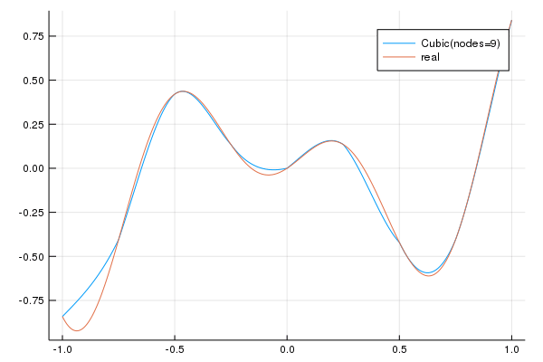

---
html:
    embed_local_images: true
    offline: true
    toc: true
---
# 计算物理第七次作业 {ignore=true}
>万国麟
>2017141221045

<!-- @import "[TOC]" {cmd="toc" depthFrom=1 depthTo=6 orderedList=false} -->

<!-- code_chunk_output -->

* [插值函数](#插值函数)
* [Problem 1](#problem-1)
	* [Code](#code)
	* [运行结果](#运行结果)
* [Problem 2](#problem-2)
	* [Code](#code-1)
	* [运行结果](#运行结果-1)
* [Problem 3](#problem-3)
	* [Code](#code-2)
	* [运行结果](#运行结果-2)

<!-- /code_chunk_output -->

## 插值函数
@import "./Cubic.jl" {as="julia"}
其中`Cubic`函数为总用于生成插值函数的函数，其调用的`FuncArray`函数为使用指定插值自变量，函数值以及求得的m值列表得到插值函数的函数。其中`Thomas`函数为用于求解三对角矩阵所用函数。`Produce`函数为给出所需插值点以及插值函数求得插值函数值的函数。
## Problem 1
### Code
@import "./Problem_1.jl" {as="julia"}
### 运行结果
插值结果如下

>Figure 1 Problem_1

## Problem 2
### Code
@import "./Problem_2.jl" {as="julia"}
### 运行结果

>Figure 2 Problem_2

## Problem 3
### Code
@import "./Problem_3.jl" {as="julia"}
### 运行结果

>Figure 3 Problem_3