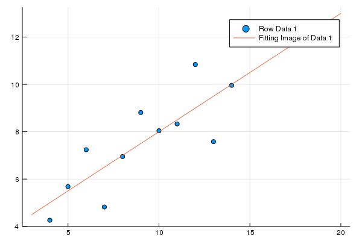
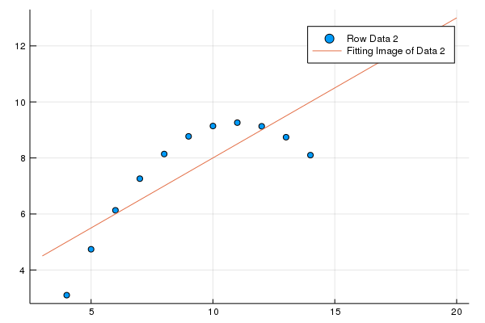
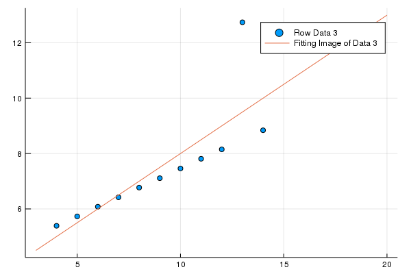
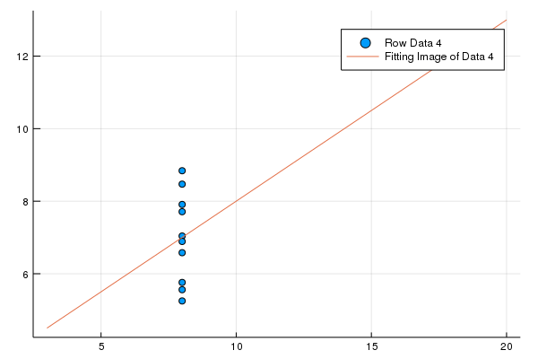

---
html:
    embed_local_images: true
    offline: true
    toc: true
---
# 计算物理第八次作业
>万国麟
>2017141221045

<!-- @import "[TOC]" {cmd="toc" depthFrom=1 depthTo=6 orderedList=false} -->

<!-- code_chunk_output -->

- [ 计算物理第八次作业](#计算物理第八次作业)
  - [ Problem 1](#problem-1)
    - [ Code](#code)
    - [ 运行结果及分析](#运行结果及分析)
  - [ Problem 2](#problem-2)
    - [ Code](#code-1)
    - [ 运行结果及分析](#运行结果及分析-1)

<!-- /code_chunk_output -->

## Problem 1
### Code
@import "./Problem_1/p_1main.jl" {as=julia}
### 运行结果及分析
>the coefficient is (0.5000909090909091, 3.0000909090909103)
>the coefficient is (0.5, 3.000909090909091)
>the coefficient is (0.49972727272727274, 3.0024545454545466)
>the coefficient is (0.49990909090909086, 3.0017272727272726)
>1.802810260132835
>1.97334179740443
>1.4822380243238233
>1.9629324382231115

+ Data 1
  $\chi^2=1.802810260132835$
  
  

+ Data 2
  $\chi^2=1.97334179740443$
  

+ Data 3
  $\chi^2=1.4822380243238233$
  

+ Data 4
  $\chi^2=1.9629324382231115$
  

## Problem 2
### Code
@import "./Problem_2/p_2main.jl" {as=julia}
### 运行结果及分析
>τ=89.79769902217106
>A=122.92369239941908

自变量变化使得非线性规划变为线性规划
$$lnN=y$$
$$y=lnA-\frac{x}{\tau}=C+Dx$$
所以
$$\tau=-\frac{1}{D}$$
$$A=e^C$$