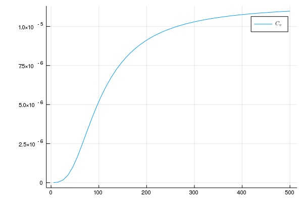
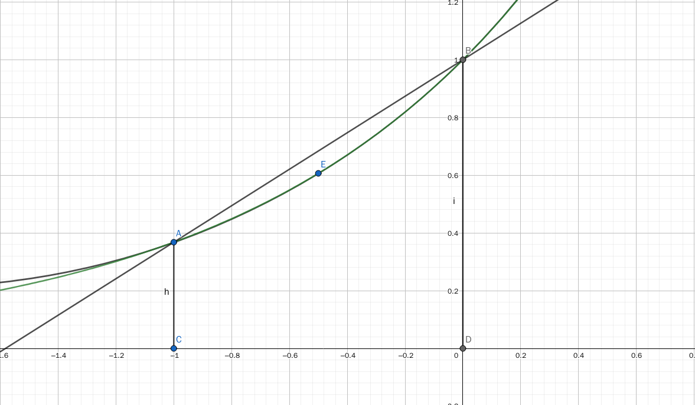
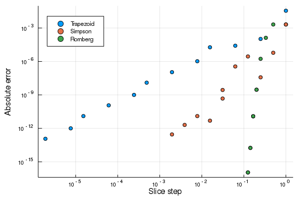

# 计算物理第九次作业
>万国麟
>2017141221045

## Problem 1
### Code
@import "./Problem_1.jl" {as=julia}
### 运行结果

>Figure 1 $C_{v}$图像

### 结果分析
使用Simphon积分法计算$C_{v}$的函数值,其中`Simphon`函数为积分函数,`main`函数用于生成函数值,`Plot`函数用于绘图并保存.
在计算过程中,考虑到被积函数在$0$处不解析,考虑采用罗必塔法则
$$\lim\limits_{x\to0}\frac{x^4e^{x}}{(e^x-1)^2}=0$$
所以可以在$0$处右加一个小量`tolerance`来避免无解同时不会影响整个积分值.
最终结果的图像也可以证明确实并无太大影响.
## Problem 2
### Code
包含整个自适应Trapezoid与Simpson积分的代码如下
@import "./Adaptive.jl" {as=julia}
用于Problem 2求解过程的代码如下
@import "./Problem_2.jl" {as=julia}
### 运行结果
>The result of trapzoid method is 0.4558325322801436, and the number of slices is 524288
>The result of simpson method is 0.4558325323038125, and the number of slices is 2048

### 结果分析
自适应过程中,`trap`参数为确定是否采用Trapezoid方法的布尔变量.当其值为`True`时,采用Trapezoid方法计算,否则采用Simphon方法计算.每次递归均会对下一次计算的误差上限进行半衰来保证总误差始终在`eps`之内.`Adaptive`函数为调用每个方法的自适应算法来进行给定函数`func`在给定上下限`upper`,`lower`之间误差限制在`eps`之内的一个积分值以及进行区间划分的次数`count`.最终结果中,通过两种方法所得结果在给定误差允许范围$10^{-10}$内数据稳定相同,但是在划分次数上却是天壤之别.
使用Trapezoid方法来进行计算所需的划分次数是Simphon方法的500倍(仅针对$10^{-10}$精度而言,该比值会随着精度设置的不同而变化),通过分析两个方法计算积分值的过程,我们可知两种方法均是牛顿-寇次公式的特定类型.
对于Trapezoid方法而言,其计算方法为将两个端点之间的连接看成线性连接,所以其每段的计算公式为
$$Temp=\frac{h}{2}(f(lower)+f(upper))$$
而Simphon算法将两个端点之间的连接看成是一个二次曲线,该二次曲线由两个端点以及区间中点来确定.经过计算最后的积分值可以近似表示为
$$Temp=\frac{h}{6}(f(lower)+4f(\frac{lower+upper}{2})+f(upper))$$
从图形来看可以明显看出,使用Simphon所拟合的曲线更接近原函数,所以也更能快速收敛到一个精确值

>Figure 2 Trapezoid和Simphon几何上的比较
>(其中绿线为所需函数)

## Problem 3
### Code
@import "./Problem_3.jl" {as=julia}
### 运行结果
运行结果如下
>Trapezoid
>  The power of slice step(h) is: 2.002
>Simpson
>  The power of slice step(h) is: 6.187
>Romberg
>  The power of slice step(h) is: 7.767

误差与分割步长的分布关系如下图

>Figure 3 误差与分割步长的分布

### 结果分析
其中`Raw`函数采用递归方式生成外推表中第一列函数值,用于在`Re`整个的递归过程中递推至第一列时的求值.`Romberg`函数是整个龙贝格积分的主要函数,可以得到给定函数`func`在`lower`到`upper`之间误差在`tolerance`之内的积分值,同时返回划分次数`count`.Trapezoid和Simpson在引入的`Adaptive.jl`文件中.
对于Trapzoid积分而言,如果每个积分区间的长度相等有
$$
\int_{a}^{b} f(x) d x \approx \frac{b-a}{N}\left[\frac{f(a)+f(b)}{2}+\sum_{k=1}^{N-1} f\left(a+k \frac{b-a}{N}\right)\right]
$$
可改写为
$$
\int_{a}^{b} f(x) d x \approx \frac{b-a}{2 N}\left(f\left(x_{0}\right)+2 f\left(x_{1}\right)+2 f\left(x_{2}\right)+\cdots+2 f\left(x_{N-1}\right)+f\left(x_{N}\right)\right)
$$
其中$x_{k}=a+k \frac{b-a}{N}, k=0,1, \ldots, N$,则其余项为
$$
R_{n}(f)=-\frac{b-a}{12} h^{2} f^{\prime \prime}(\eta), \eta \in(a, b)
$$
该理论推导值与实验结果相吻合
对于Simpson积分而言,其带误差项的计算公式为
$$
\int_{a}^{b} f(x) dx=\frac{h}{3}[f(a)+f(b)+4\sum_{i=1}^{m}f(x_{2i-1})+2\sum_{i=1}^{m-1}f(x_{2i})]-\sum_{i=0}^{m-1}\frac{h^5}{90}f^{(4)}(c_{i})
$$
而实验最后结果表示误差约正比于$h^6$,或许是因为误差项过小而导致$f^{(4)}(c_{i})$的正负相消使得最后的误差项阶数升高.
而对于Romberg积分而言,无法给出确定的误差关系.